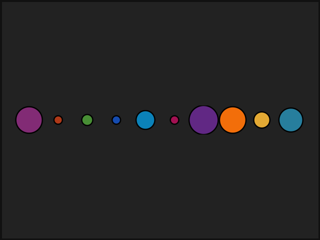

# artpack

[](https://www.python.org/downloads/)
[](https://codecov.io/gh/Meghansaha/artpack-py)
[](https://github.com/Meghansaha/artpack-py/actions)
[](https://pypi.org/project/artpack/#history)
[](https://github.com/astral-sh/ruff)
[](https://www.repostatus.org/#active)
[](https://github.com/Meghansaha/artpack-py/blob/main/LICENSE)

<p align="center" width="100%">

</p>

Python port of the R package [artpack](https://CRAN.R-project.org/package=artpack), bringing easier generative art to the Python ecosystem.

## About
The goal of artpack is to help generative artists of all levels create generative art in Python. The artpack package is intended for use with the [plotnine](https://plotnine.org) package.


artpack provides curated color palettes designed for generative art and data visualization. This is a work-in-progress port of the original R package.

## Installation

```bash
pip install artpack-py
```

## Quick Start

```python
import numpy as np
import plotnine as p9
from polars import concat

from artpack import art_pals, circle_data

# Get colors from palettes
colors_random = art_pals("rainbow", n=10, randomize=True)

# Prepare data
x_positions = range(1, 11)
# Create evenly spaced values between 0.1 and 0.5
base_sizes = np.linspace(0.1, 0.5, 10)
# Randomly sample sizes with replacement
sizes = np.random.choice(base_sizes, size=10, replace=True)

# Create circle data for each position
circles = [
    circle_data(
        x=x_pos,
        y=0,
        fill=color,
        color="#000000",
        radius=size,
        group_var=True,
        group_value=f"Circle_{x_pos:02d}",
    )
    for x_pos, color, size in zip(x_positions, colors_random, sizes)
]

# Combine all circle dataframes into one
df = concat(circles)

# Create plot
(
    p9.ggplot(df, p9.aes("x", "y", group="group"))
    + p9.theme_void()  # Remove axis labels and background
    + p9.theme(
        plot_background=p9.element_rect(
            fill="#222222", color="#111111", size=5
        )
    )
    + p9.geom_polygon(fill=df["fill"], color=df["color"], size=1)
    + p9.coord_equal(expand=False, xlim=(0, 11))  # Equal aspect ratio
)
```

{align='center'}

## Development Status

🚧 **Work in Progress** - Currently porting core functionality from the [R version](https://meghansaha.github.io/artpack/reference/index.html). More features coming soon!

**Currently implemented:**

- ✅ Color palette generation (`art_pals()`)
- ✅ Circle data generation (`circle_data()`)
- ✅ 100% test coverage
- ✅ CI/CD with GitHub Actions

**Roadmap:**

- Additional color palette tools (Functions that help with color-related tasks.)
- Asset creation (Functions that help with making data for generative art.)
- Geometric testing tools (Functions that help with geometric/spatial analysis for generative art.)
- Grouping tools (Functions that help with grouping generative art data.)
- Sequencing tools (Functions that help with numeric sequencing.)
- Transformation tools (Functions that help with transforming existing generative art data.)

## Relevant Links

- **Python Package (PyPI):** [artpack-py](https://pypi.org/project/artpack/)
- **Original R Package (CRAN):** [artpack](https://CRAN.R-project.org/package=artpack)
- **GitHub Repository:** [github.com/Meghansaha/artpack-py](https://github.com/Meghansaha/artpack-py)